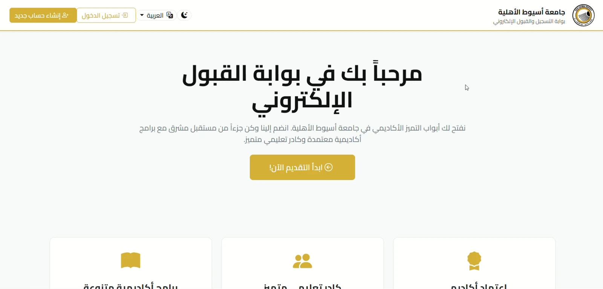
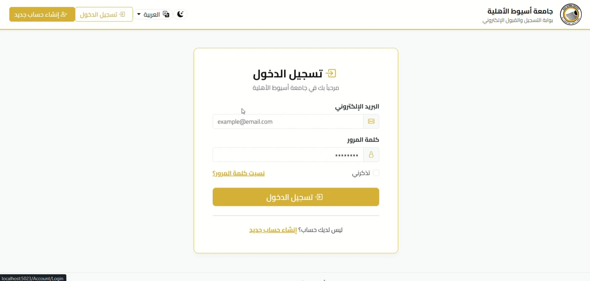
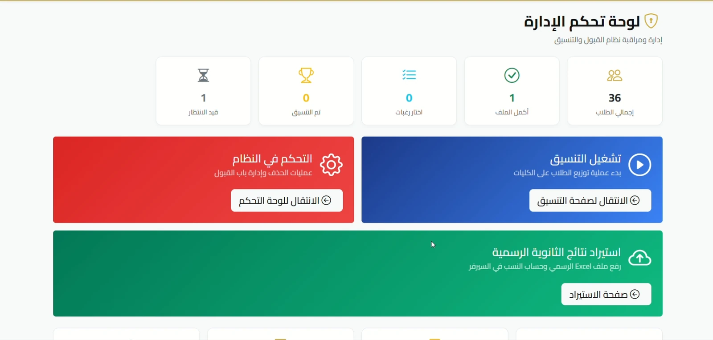
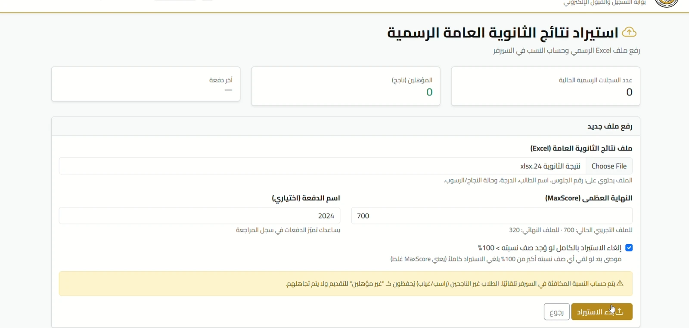
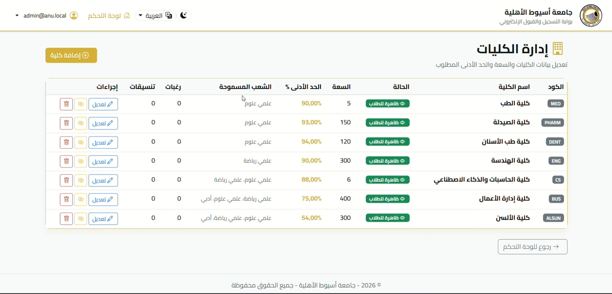
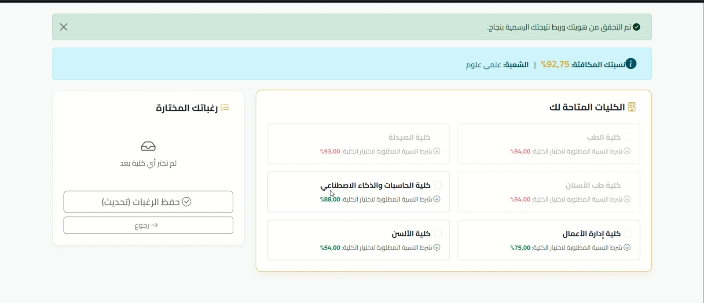
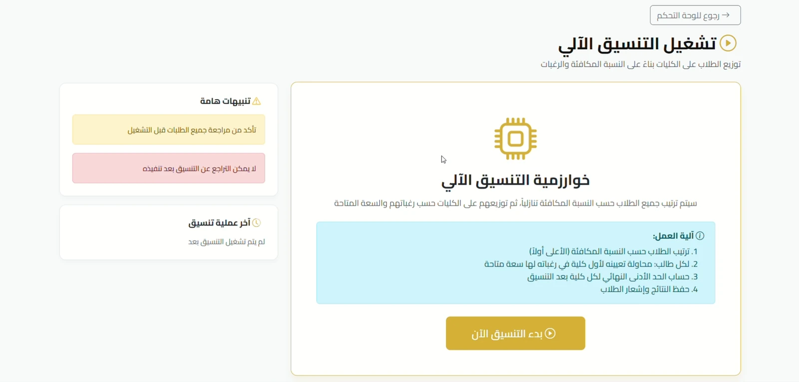
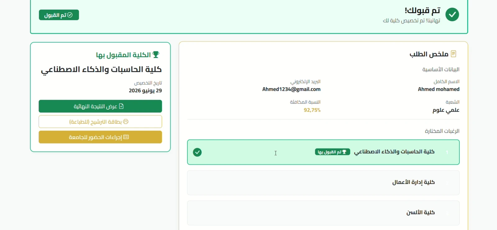

# University Admission System

A secure, role-based university admission platform built with **ASP.NET Core MVC**, **Entity Framework Core**, and **SQL Server**.

The system supports the complete admission workflow: importing official student results, verifying applicant identity, collecting ranked college preferences, and automatically allocating students according to score, capacity, and eligibility rules.

## Core Features

- Official results import from Excel using `SqlBulkCopy`
- Student verification by national ID and seat number
- Ranked college-preference submission
- Automated seat-allocation workflow
- Capacity, minimum-score, section, and eligibility validation
- Separate Admin and Student roles
- ASP.NET Core Identity authentication and authorization
- Account lockout, password policy, anti-forgery protection, and server-side validation
- Admission-period controls and workflow guards
- Arabic and English localization with RTL/LTR support
- Admin dashboards, reports, audit logs, and nomination results

## Technology Stack

- C# and .NET 8
- ASP.NET Core MVC
- Entity Framework Core
- Microsoft SQL Server
- ASP.NET Core Identity
- ExcelDataReader and `SqlBulkCopy`
- Razor Views
- Bootstrap

## Project Structure

```text
Controllers/     MVC controllers and application workflows
Data/            EF Core DbContext and database initialization
Helpers/         Shared display helpers
Migrations/      EF Core database migrations
Models/          Domain and Identity entities
Resources/       Arabic and English localization resources
Services/        Admission gates, identity provider, and email abstractions
ViewModels/      Request and presentation models
Views/           Razor views for Admin, Student, Account, and shared UI
wwwroot/         Static CSS, JavaScript, images, and client libraries
```

## Main Workflow

1. An administrator imports official student results from an Excel file.
2. A student creates an account and verifies identity using national ID and seat number.
3. The system links the student to the matching official result.
4. The student completes the application and submits ranked college preferences.
5. The administrator runs the allocation process.
6. The system assigns each eligible student to the highest-ranked available college that satisfies the admission rules.
7. The student views the result and prints the nomination card.

## Security Highlights

- Role-based access control for Admin and Student operations
- Server-side validation for scores, eligibility, and admission rules
- Account lockout after repeated failed login attempts
- Strong password requirements
- Anti-forgery validation on state-changing requests
- Hardened authentication cookies
- Security response headers
- Sensitive admin credentials loaded through .NET User Secrets or environment variables
- Uploaded/generated documents excluded from source control
## Screenshots

<table>
  <tr>
    <td width="50%">
      
      <p align="center"><b>Admission Portal Home</b></p>
    </td>
    <td width="50%">
      
      <p align="center"><b>Secure Login</b></p>
    </td>
  </tr>
  <tr>
    <td width="50%">
      
      <p align="center"><b>Admin Dashboard</b></p>
    </td>
    <td width="50%">
      
      <p align="center"><b>Official Records Import</b></p>
    </td>
  </tr>
  <tr>
    <td width="50%">
      
      <p align="center"><b>College Management</b></p>
    </td>
    <td width="50%">
      
      <p align="center"><b>Eligibility-Based Preferences</b></p>
    </td>
  </tr>
  <tr>
    <td width="50%">
      
      <p align="center"><b>Automated Allocation Engine</b></p>
    </td>
    <td width="50%">
      
      <p align="center"><b>Allocation Summary</b></p>
    </td>
  </tr>
</table>


## Getting Started

### Requirements

- .NET 8 SDK
- SQL Server LocalDB, SQL Server Express, or SQL Server
- Visual Studio 2022 or VS Code

### 1. Clone the repository

```bash
git clone https://github.com/3ab3al11/University-Admission-System.git
cd University-Admission-System
```

### 2. Configure the database

The default configuration uses SQL Server LocalDB:

```text
Server=(localdb)\MSSQLLocalDB;Database=ANU_Admissions;Trusted_Connection=True;MultipleActiveResultSets=true;TrustServerCertificate=True
```

To use another SQL Server instance, update `ConnectionStrings:DefaultConnection` in `appsettings.Development.json`.

### 3. Configure the administrator account

The project does not store an administrator password in source control. Configure it with .NET User Secrets:

```bash
dotnet user-secrets set "AdminSeed:Email" "admin@anu.local"
dotnet user-secrets set "AdminSeed:Password" "ChangeThis123!"
dotnet user-secrets set "AdminSeed:FullName" "System Administrator"
```

Use a different strong password for your local environment.

### 4. Restore and run

```bash
dotnet restore
dotnet run
```

Database migrations are applied automatically when the application starts.

## Excel Import Format

The first worksheet must contain a header row followed by student records in this column order:

| Column | Value |
|---|---|
| 1 | Seat number |
| 2 | Full name |
| 3 | Total score |
| 4 | Student case code |
| 5 | Student case description |
| 6 | Additional flag |

The import accepts `.xlsx` and `.xls` files. The administrator also enters the maximum possible score so the system can calculate percentages.

## Privacy Note

The repository contains anonymized mock identity records for development purposes. Real student documents, generated files, local databases, passwords, and user uploads are intentionally excluded from source control.

## Author

**Ahmed Mohamed Abdel Aal**  
Junior Backend .NET Developer

- [LinkedIn](https://www.linkedin.com/in/ahmed-mohamed-web-dev/)
- [GitHub](https://github.com/3ab3al11)
