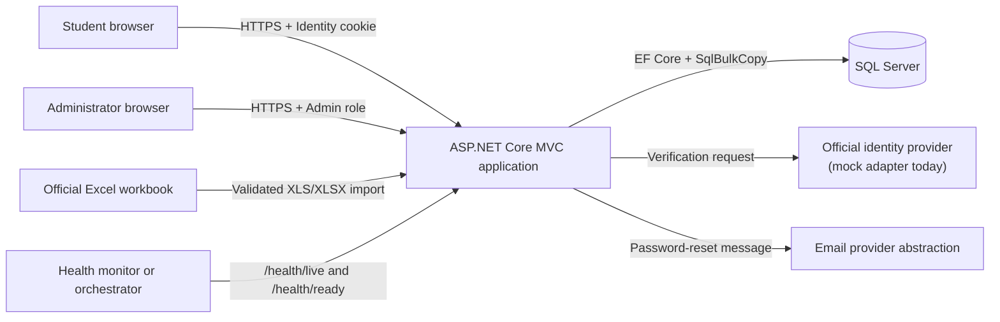
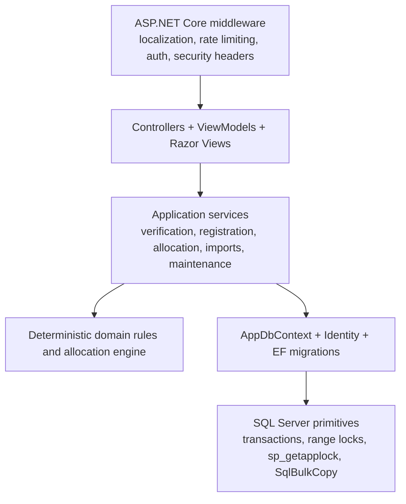
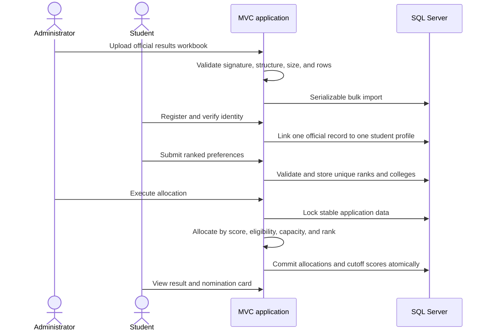
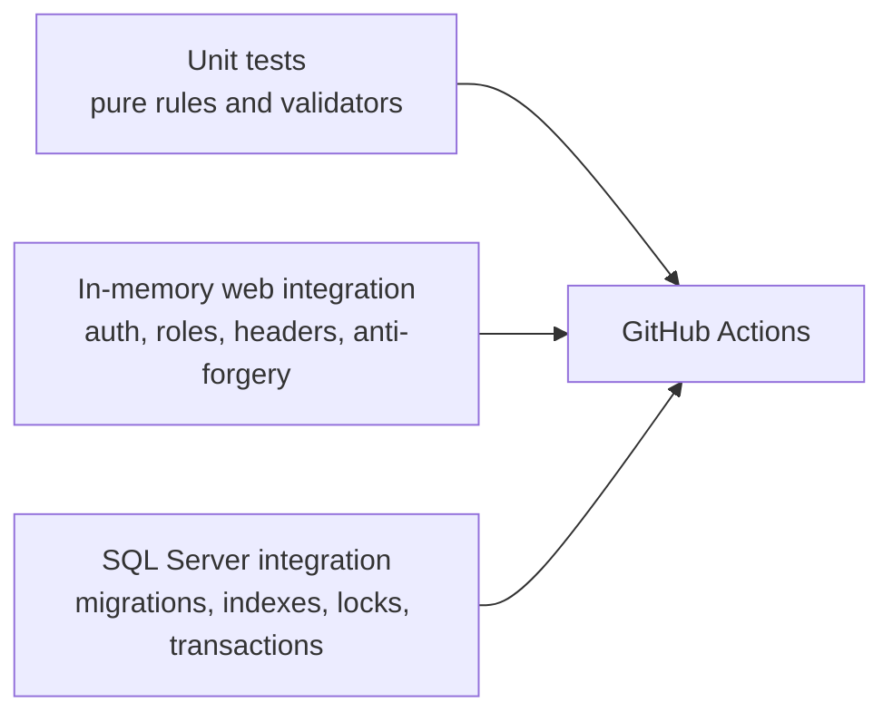

# Architecture

The University Admission System is a modular ASP.NET Core MVC monolith. This
keeps deployment and local development simple while separating business rules,
web concerns, and SQL Server-specific consistency operations.

## System context

The official identity and email integrations are behind interfaces. The local
project uses a mock identity adapter and a development-only console email
sender; a real deployment can replace those registrations without changing the
controllers.

## Application layers

- `Controllers/` coordinates HTTP requests, authorization, validation, and
  presentation. Controllers do not implement the allocation algorithm.
- `Services/` owns application workflows and transaction boundaries.
- Pure rule classes and `AllocationEngine` are deterministic and easy to test.
- `Data/AppDbContext.cs` defines relational constraints as a final defense
  against concurrent or handcrafted requests.
- SQL Server-specific services use serializable transactions, range locks, and
  application locks where EF-only behavior is not strong enough.

## Admission workflow

## Consistency and security boundaries

- ASP.NET Core Identity separates `Admin` and `Student` areas.
- Unsafe MVC requests are protected globally by anti-forgery validation.
- Authentication endpoints are rate-limited by client partition.
- Registration uses serializable isolation and a filtered unique phone index.
- Preference rank and college uniqueness are enforced in both validation and
  SQL indexes.
- Official-record maintenance uses `sp_getapplock` plus range locks so multiple
  application instances cannot perform conflicting destructive operations.
- Allocation and imports use explicit transactions and only publish committed
  results.
- Password-reset links use a configured trusted origin, never the incoming Host
  header.
- Authenticated responses are marked `no-store` and receive security headers.
- Content Security Policy uses a new cryptographic nonce per response, blocks
  inline event-handler attributes, and permits scripts only from the app itself.
- Bootstrap JavaScript/CSS is served locally; the remaining version-pinned icon
  stylesheet is protected with Subresource Integrity.
- Server-generated request IDs connect safe user-facing error pages to
  structured logs without trusting a client-supplied identifier.
- Public health responses expose only aggregate status; readiness checks SQL
  Server connectivity and returns HTTP 503 when the database is unavailable.

## Test strategy

The fast suite runs without external infrastructure. A separate CI job starts
SQL Server 2022 and runs provider-specific tests against a fresh migrated
database. Formatting verification, .NET recommended analyzers, CodeQL, NuGet
audit, migration drift detection, and line/branch coverage baselines provide
additional repository-level gates. NuGet lock files freeze
the resolved transitive graph for CI and Docker, and Dependency Review blocks
pull requests that introduce known moderate-or-higher vulnerabilities.

## Deployment shape

`Dockerfile` publishes a multi-stage .NET 8 image and runs as the built-in
non-root `app` user. `compose.yml` is intended for local evaluation: it binds
the web and database ports to loopback, persists SQL Server data and Data
Protection keys, and requires the database password through an uncommitted
`.env` file.

For a real hosted environment, terminate HTTPS at a trusted reverse proxy,
provide secrets through the hosting platform, replace the email and official
identity adapters, and use managed backup and monitoring services.
